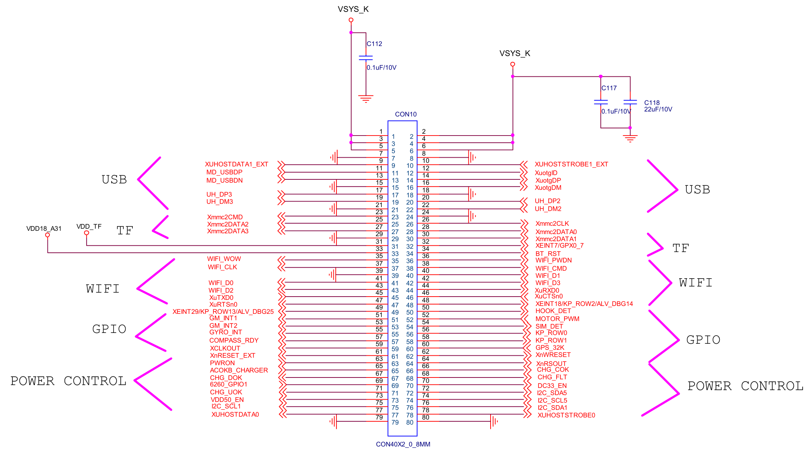

# CON1

## PIN1,2,3,4,5,6 - VSYS_K

接电源VSYS_K，其中，1、3、5脚在开发板上有0.1 uF电容对地滤波，2、4、6脚在开发板上由0.1 uF、22 uF电容并联对地滤波。

核心板上该供电标为VSYS，接PMIC芯片S5M8767A的供电电源引脚VBAT、AVDDT、AVDDB、VDD_CP32K，为系统总电源。

## PIN7,8 - GND

接地。

## PIN9 - XUHOSTDATA1_EXT

接核心板上USB3503A主控（上游USB HSIC（High-Speed Inter-Chip） - 下游USB链路主控），使用R106号NC电阻和引自4412芯片E8脚XUHOSTDATA1（该引脚从4412芯片的USB HSIC 1引出）的数据链路连接，在USB3503A主控芯片上汇入到DATA（HSIC数据）引脚。

开发板上该引脚未引出。

由于该线路被NC电阻（可能未安装的电阻）断开，推测该引脚用于连接外部的HSIC控制器。

## PIN10 - XUHOSTSTROBE1_EXT

接核心板上USB3503A主控（上游USB HSIC（High-Speed Inter-Chip） - 下游USB链路主控），使用R105号NC电阻和引自4412芯片D8脚XUHOSTSTROBE1（该引脚从4412芯片的USB HSIC 1引出）的数据链路连接，在USB3503A主控芯片上汇入到STROBE（HSIC选通）引脚。

开发板上该引脚未引出。

由于该线路被NC电阻（可能未安装的电阻）断开，推测该引脚用于连接外部的HSIC控制器。

## PIN11 - MD_USBDP

开发板上USB（Host模式）接口CON15的数据正（D+）引脚。在核心板上接到USB3503A的USBDN1_DP（A1）引脚。

## PIN12 - XuotgID

接开发板上USB OTG接口CON7的ID引脚。在核心板上接到4412芯片的XuotgID（D9）引脚。

## PIN13 - MD_USBDN

开发板上USB（Host模式）接口CON15的数据负（D-）引脚。在核心板上接到USB3503A的USBDN1_DM（B1）引脚。

## PIN14 - XuotgDP

接开发板上USB OTG接口CON7的D+引脚。在核心板上接到4412芯片的XuotgDP（A9）引脚。

## PIN15 - GND

接地。

## PIN16 - XuotgDM

接开发板上USB OTG接口CON7的D-引脚。在核心板上接到4412芯片的XuotgDM（A8）引脚。

## PIN17 - UH_DP3

开发板上USB（Host模式）接口CON14的数据正（D+）引脚。在核心板上接到USB3503A的USBDN3_DP（C1）引脚。

## PIN18 - GND

接地。

## PIN19 - UH_DM3

开发板上USB（Host模式）接口CON14的数据负（D-）引脚。在核心板上接到USB3503A的USBDN3_DM（D1）引脚。

## PIN20 - UH_DP2

接开发板上USB2.0百兆以太网芯片DM9621ANP（U8）的DP引脚。在核心板上接到USB3503A的USBDN2_DP（C2）引脚。

## PIN21 - GND

接地。

## PIN22 - UH_DM2

接开发板上USB2.0百兆以太网芯片DM9621ANP（U8）的DM引脚。在核心板上接到USB3503A的USBDN2_DM（D2）引脚。

## PIN23 - Xmmc2CMD

接开发板上TF卡槽J1的CMD（命令）引脚。在核心板上接到4412芯片的Xmmc2CMD/GPK2_1（J4）引脚。

## PIN24 - GND

接地。

## PIN25 - Xmmc2DATA2

接开发板上TF卡槽J1的DAT2（数据线2）引脚。在核心板上接到4412芯片的Xmmc2DATA2/GPK2_5（K4）引脚。

## PIN26 - Xmmc2CLK

接开发板上TF卡槽J1的CLK（时钟）引脚。在核心板上接到4412芯片的Xmmc2CLK/GPK2_0（N4）引脚。

## PIN27 - Xmmc2DATA3

接开发板上TF卡槽J1的CD/DAT3（数据线3）引脚。在核心板上接到4412芯片的Xmmc2DATA3/GPK2_6（N5）引脚。

## PIN28 - Xmmc2DATA0

接开发板上TF卡槽J1的DAT0（数据线0）引脚。在核心板上接到4412芯片的Xmmc2DATA0/GPK2_3（J5）引脚。

## PIN29 - GND

接地。

## PIN30 - Xmmc2DATA1

接开发板上TF卡槽J1的DAT1（数据线1）引脚。在核心板上接到4412芯片的Xmmc2DATA1/GPK2_4（K5）引脚。

## PIN31 - VDD_TF

TF卡槽供电。

## PIN32 - XEINT7/GPX0_7

接开发板上TF卡槽J1的SW2引脚。在核心板上接到4412芯片的XEINT7/ALV_DBG3/GPX0_7（D5）引脚。

## PIN33 - VDD18_A31

接开发板Wi-Fi连接器座子J40并引出。在核心板上从PMIC芯片S5M8767A的VLDO25（D12）引脚引出。

## PIN34 - BT_RST

开发板上未引出。在核心板上接到4412芯片的Xi2s0SDO_2/ST_INT/GPZ6（Y1）引脚。

考虑到与Wi-Fi相关功能引脚共同编组，推测为蓝牙模块（Bluetooth, BT）相关。

## PIN35 - WIFI_WOW

接开发板Wi-Fi连接器座子J40并引出。在核心板上接到4412芯片的XEINT12/KP_COL4/ALV_DBG8/GPX1_4（H7）引脚。

## PIN36 - WIFI_PWDN

接开发板Wi-Fi连接器座子J40并引出。在核心板上接到4412芯片的Xi2s0SDO_1/ST_TICK/GPZ5（W4）引脚。

## PIN37 - WIFI_CLK

接开发板Wi-Fi连接器座子J40并引出。在核心板上接到4412芯片的Xmmc3CLK/GPK3_0（L6）引脚。

## PIN38 - WIFI_CMD

接开发板Wi-Fi连接器座子J40并引出。在核心板上接到4412芯片的Xmmc3CMD/GPK3_1（N6）引脚。

## PIN39 - GND

接地。

## PIN40 - WIFI_D1

接开发板Wi-Fi连接器座子J40并引出。在核心板上接到4412芯片的Xmmc3DATA1/SD_2_DATA5/GPK3_4（M7）引脚。

## PIN41 - WIFI_D0

接开发板Wi-Fi连接器座子J40并引出。在核心板上接到4412芯片的Xmmc3DATA0/SD_2_DATA4/GPK3_3（M6）引脚。

## PIN42 - WIFI_D3

接开发板Wi-Fi连接器座子J40并引出。在核心板上接到4412芯片的Xmmc3DATA3/SD_2_DATA7/GPK3_6（M5）引脚。

## PIN43 - WIFI_D2

接开发板Wi-Fi连接器座子J40并引出。在核心板上接到4412芯片的Xmmc3DATA2/SD_2_DATA6/GPK3_5（N7）引脚。

## PIN44 - XuRXD0

接开发板Wi-Fi连接器座子J40并引出。在核心板上接到4412芯片的XuTXD0/GPA0_1（AE25）引脚。

## PIN45 - XuTXD0

接开发板Wi-Fi连接器座子J40并引出。在核心板上接到4412芯片的XuRXD0/GPA0_0（AD22）引脚。

## PIN46 - XuCTSn0

接开发板Wi-Fi连接器座子J40并引出。在核心板上接到4412芯片的XuRTSn0/GPA0_3（AF23）引脚。

## PIN47 - XuRTSn0

接开发板Wi-Fi连接器座子J40并引出。在核心板上接到4412芯片的XuCTSn0/GPA0_2（AF25）引脚。

## PIN48 - XEINT18/KP_ROW2/ALV_DBG14

接开发板上音频模块WM8960GEFL（U10，手册描述为“立体声编解码器与1W立体声D类扬声器驱动器和耳机驱动器的便携式音频应用”）的ADCLRC/GPIO1（手册描述为音频接口ADC左右/时钟或GPIO1）引脚。

开发板上CON2_2_54P/NC（J5）的2号脚使用了该引脚。

在核心板上接到4412芯片的XEINT18/KP_ROW2/ALV_DBG14/GPX2_2（G5）引脚。同时通过100K电阻R121接到VDDIOPERI_18。

## PIN49 - XEINT29/KP_ROW13/ALV_DBG25

接开发板上UART+KEYPAD座子J41并引出。在核心板上接到4412芯片的XEINT29/KP_ROW13/ALV_DBG25/GPX3_5（C7）引脚。同时通过100K电阻R120接到VDDIOPERI_18。

## PIN50 - HOOK_DET

接开发板上UART+KEYPAD座子J41并引出。在核心板上接到4412芯片的XEINT11/KP_COL3/ALV_DBG7/GPX1_3（D7）引脚。

## PIN51 - GM_INT1

接开发板上UART+KEYPAD座子J41并引出。在核心板上接到4412芯片的XEINT24/KP_ROW8/ALV_DBG20/GPX3_0（C3）引脚。

## PIN52 - MOTOR_PWM

接开发板上蜂鸣器PIEZO BUZZER_2（PZ1）。在核心板上接到4412芯片的XpwmTOUT0/LCD_FRM/GPD0_0（AE24）引脚。

## PIN53 - GM_INT2

开发板上未引出。在核心板上接到4412芯片的XEINT25/KP_ROW9/ALV_DBG21/GPX3_1（B4）引脚。

## PIN54 - SIM_DET

接开发板上物理“返回”（PWRON2）键。在核心板上接到4412芯片的XEINT10/KP_COL2/ALV_DBG6/GPX1_2（H6）引脚。

## PIN55 - GYRO_INT

接开发板上物理“休眠”（PWRON3）键。在核心板上接到4412芯片的XEINT27/KP_ROW11/ALV_DBG23/GPX3_3（B6）引脚。

## PIN56 - KP_ROW0

接开发板上物理“音量-”（PWRON5）键。在核心板上接到4412芯片的XEINT16/KP_ROW0/ALV_DBG12/GPX2_0（F8）引脚。

## PIN57 - COMPASS_RDY

接开发板上GPIO座子J38并引出。在核心板上接到4412芯片的XEINT28/KP_ROW12/ALV_DBG24/GPX3_4（H9）引脚。

## PIN58 - KP_ROW1

接开发板上物理“音量+”（PWRON4）键。在核心板上接到4412芯片的XEINT17/KP_ROW1/ALV_DBG13/GPX2_1（F9）引脚。

## PIN59 - XCLKOUT

开发板上未引出。在核心板上接到4412芯片的XCLKOUT/ETC6_1（G4）引脚。

## PIN60 - GPS_32K

开发板上未引出。在核心板上接到PMIC芯片S5M8767A上Clock引脚分区的CP32K（C8）引脚。

为PMIC芯片协处理器（CP）32.768 kHz时钟信号输出引脚。

## PIN61 - XnRESET_EXT

开发板上未引出。在核心板上经过0欧电阻R82和来自4412芯片XnRESET/ETC6_0（F7）引脚的XnRESET信号线连接，并汇入PMIC芯片S5M8767A上Control and Communications引脚分区的RSOB（F5）引脚。

为PMIC芯片复位（RESET）信号输出引脚。

## PIN62 - XnWRESET

开发板上未引出。在核心板上接到4412芯片的XnWRESET/ETC6_3（F2）引脚。

为4412芯片的热复位信号（WARM RESET）输入引脚，低电平有效。

## PIN63 - PWRON

开发板上经由RESET（SW1）按钮间接接到VSYS。在核心板上接到PMIC芯片S5M8767A上Control and Communications引脚分区的PWRON（E7）引脚。

电源使能、系统上电引脚。

## PIN64 - XnRSOUT

开发板上未引出。在核心板上接到4412芯片的XnRSTOUT/ETC6_2（A4）引脚。

推测为4412芯片的复位信号输出引脚。

## PIN65 - ACOKB_CHARGER

开发板上使用800K（NC）电阻R173对VSYS断路，同时使用0欧电阻R174对地短接。

在核心板上接到PMIC芯片S5M8767A上Control and Communications引脚分区的ACOKB（D6）引脚。

外部充电器直流输入状态正常（VDCIN OK）信号引脚。

## PIN66 - CHG_COK

接开发板上UART+KEYPAD座子J41并引出，核心板上接4412芯片的XEINT23/KP_ROW7/ALV_DBG19/GPX2_7（E7）引脚。

## PIN67 - CHG_DOK

开发板上使用800K电阻R165接VSYS。在核心板上接到PMIC芯片S5M8767A上Control and Communications引脚分区的JIGONB（F7）引脚。

JIG电源使能信号。

## PIN68 - CHG_FLT

接开发板上UART+KEYPAD座子J41并引出，核心板上接4412芯片的XEINT8/KP_COL0/ALV_DBG4/GPX1_0（A3）引脚。

## PIN69 - 6260_GPIO1

接开发板上UART+KEYPAD座子J41并引出。在核心板上接到4412芯片的XEINT22/KP_ROW6/ALV_DBG18/GPX2_6（E9）引脚。

## PIN70 - DC33_EN

接开发板上GPIO座子J38并引出。在核心板上接到4412芯片的Xmmc1CLK/GPK1_0（R2）引脚。

## PIN71 - CHG_UOK

接开发板上UART+KEYPAD座子J41并引出。在核心板上接到4412芯片的XEINT13/KP_COL5/ALV_DBG9/GPX1_5（E2）引脚。

## PIN72 - I2C_SDA5

开发板上未引出。在核心板上接到4412芯片的XspiMISO0/I2C_5_SDA/GPB_2（AH27）引脚，同时通过1K电阻R21接到VDDIOPERI_18。

## PIN73 - VDD50_EN

开发板上通过1K电阻R2和L9014三极管Q3以及SMD2012红色LED灯LED3连接。在核心板上连接到4412芯片的Xmmc1CMD/GPK1_1（J2）引脚。

## PIN74 - I2C_SCL5

开发板上未引出。在核心板上接到4412芯片的XspiMOSI0/I2C_5_SCL/GPB_3（AF21）引脚，同时通过1K电阻R22接到VDDIOPERI_18。

## PIN75 - I2C_SCL1

开发板上未引出。在核心板上接到4412芯片的Xi2c1SCL/GPD1_3（AG26）引脚，同时通过1K电阻R39接到VDDIOPERI_18。

## PIN76 - I2C_SDA1

开发板上未引出。在核心板上接到4412芯片的Xi2c1SDA/GPD1_2（AF26）引脚，同时通过1K电阻R38接到VDDIOPERI_18。

## PIN77 - XUHOSTDATA0

开发板上未引出。在核心板上接到4412芯片的XhsicDATA0（A7）引脚。

直通4412芯片USB HSIC 0的数据引脚。

## PIN78 - XUHOSTSTROBE0

开发板上未引出。在核心板上接到4412芯片的XhsicSTROBE0（A6）引脚。

直通4412芯片USB HSIC 0的选通引脚。

## PIN79,80 - GND

接地。