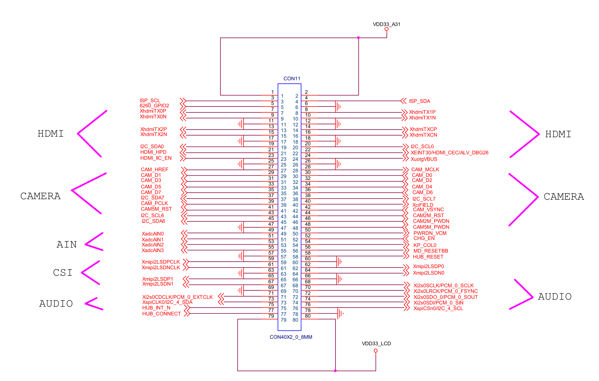

# CON2

## PIN1,2 - VDD33_A31

接供电VDD33_A31，该供电源引自核心板上PMIC芯片S5M8767A默认关闭LDO脚VLDO24。该引脚电源输出在uBoot结束后被Linux系统内的驱动程序开启。

300 mA，3.0 V供电脚。

开发板上UART+KEYPAD座子J41（引出脚）、WIFI座子J40（引出脚）使用了这个电平。

## PIN3 - ISP_SCL

开发板上未引出。在核心板上接4412芯片的XispI2C0SCL/CAM_GPIO10/GPM4_0（AE6）引脚，同时通过1K电阻R49接到VDD18_CAM。

## PIN4 - ISP_SDA

开发板上未引出。在核心板上接4412芯片的XispI2C0SDA/CAM_GPIO11/GPM4_1（AE7）引脚，同时通过1K电阻R48接到VDD18_CAM。

## PIN5 - 6260_GPIO2

开发板上通过0欧电阻R175直通HUB_CONNECT脚（CON2, PIN77）。在核心板上接4412芯片的XEINT26/KP_ROW10/ALV_DBG22/GPX3_2（G9）引脚。

## PIN6 - GND

接地。

## PIN7 - XhdmiTX0P

开发板上接HDMI插槽CON9的TMDS_D0+脚。在核心板上接4412芯片的XhdmiTX0P（AJ20）引脚。

## PIN8 - XhdmiTX1P

开发板上接HDMI插槽CON9的TMDS_D1+脚。在核心板上接4412芯片的XhdmiTX1P（AJ21）引脚。

## PIN9 - XhdmiTX0N

开发板上接HDMI插槽CON9的TMDS_D0-脚。在核心板上接4412芯片的XhdmiTX0N（AK20）引脚。

## PIN10 - XhdmiTX1N

开发板上接HDMI插槽CON9的TMDS_D1-脚。在核心板上接4412芯片的XhdmiTX1N（AK21）引脚。

## PIN11,12 - GND

接地。

## PIN13 - XhdmiTX2P

开发板上接HDMI插槽CON9的TMDS_D2+脚。在核心板上接4412芯片的XhdmiTX2P（AJ22）引脚。

## PIN14 - XhdmiTXCP

开发板上接HDMI插槽CON9的TMDS_CLK+脚。在核心板上接4412芯片的XhdmiTXCP（AJ19）引脚。

## PIN15 - XhdmiTX2N

开发板上接HDMI插槽CON9的TMDS_D2-脚。在核心板上接4412芯片的XhdmiTX2N（AK22）引脚。

## PIN16 - XhdmiTXCN

开发板上接HDMI插槽CON9的TMDS_CLK-脚。在核心板上接4412芯片的XhdmiTXCN（AK19）引脚。

## PIN17,18 - GND

接地。

## PIN19 - I2C_SDA0

开发板上接电平转换芯片TXS0102DCU（U28），转换为HDMI_SDA信号并接HDMI插槽CON9的SDA脚。在核心板上接4412芯片的Xi2c0SDA/MIPI0_BYTE_CLK/GPD1_0（AF27）引脚，同时通过1K电阻R36接到VDDIOPERI_18。

## PIN20 - I2C_SCL0

开发板上接电平转换芯片TXS0102DCU（U28），转换为HDMI_SCL信号并接HDMI插槽CON9的SCL脚。在核心板上接4412芯片的Xi2c0SCL/MIPI0_ESC_CLK/GPD1_1（AG27）引脚，同时通过1K电阻R36接到VDDIOPERI_18。

## PIN21 - HDMI_HPD

开发板上通过带电阻三极管PDTC114YE（Q1）间接接HDMI插槽CON9的HOTPLUG脚。在核心板上接4412芯片的XEINT31/HDMI_HPD/ALV_DBG27/GPX3_7（B3）引脚。

## PIN22 - XEINT30/HDMI_CEC/ALV_DBG26

开发板上接电平转换芯片TXS0102DCU（U29），转换为CBL_CEC信号并接HDMI插槽CON9的CEC脚。在核心板上接4412芯片的XEINT30/HDMI_CEC/ALV_DBG26/GPX3_6（G6）引脚。

## PIN23 - HDMI_IIC_EN

开发板上接电平转换芯片TXS0102DCU（U28）的使能引脚OE。在核心板上接4412芯片的XGNSS_RF_RSTN/GPL0_6（AB2）引脚。

## PIN24 - XuotgVBUS

接开发板上USB OTG接口CON7的VBUS引脚。在核心板上接到4412芯片的XuotgVBUS（B8）引脚。

## PIN25,26 - GND

接地。

## PIN27 - CAM_HREF

接开发板相机/AVIN连接器座子J27并引出。在核心板上接到4412芯片的XciHREF/GPJ0_2（AE12）引脚。

## PIN28 - CAM_MCLK

接开发板相机/AVIN连接器座子J27并引出。在核心板上接到4412芯片的XciCLKenb/GPJ1_3（AG10）引脚。

## PIN29 - CAM_D1

接开发板相机/AVIN连接器座子J27并引出。在核心板上接到4412芯片的XciDATA1/GPJ0_4（AG11）引脚。

## PIN30 - CAM_D0

接开发板相机/AVIN连接器座子J27并引出。在核心板上接到4412芯片的XciDATA0/GPJ0_3（AF11）引脚。

## PIN31 - CAM_D3

接开发板相机/AVIN连接器座子J27并引出。在核心板上接到4412芯片的XciDATA3/GPJ0_6（AD13）引脚。

## PIN32 - CAM_D2

接开发板相机/AVIN连接器座子J27并引出。在核心板上接到4412芯片的XciDATA2/GPJ0_5（AE13）引脚。

## PIN33 - CAM_D5

接开发板相机/AVIN连接器座子J27并引出。在核心板上接到4412芯片的XciDATA5/GPJ1_0（AF12）引脚。

## PIN34 - CAM_D4

接开发板相机/AVIN连接器座子J27并引出。在核心板上接到4412芯片的XciDATA4/GPJ0_7（AC11）引脚。

## PIN35 - CAM_D7

接开发板相机/AVIN连接器座子J27并引出。在核心板上接到4412芯片的XciDATA7/GPJ1_2（AE11）引脚。

## PIN36 - CAM_D6

接开发板相机/AVIN连接器座子J27并引出。在核心板上接到4412芯片的XciDATA6/GPJ1_1（AC12）引脚。

## PIN37 - I2C_SDA7

接开发板相机/AVIN连接器座子J27和4.3寸RGB-LCD座子CN1并引出。在核心板上接到4412芯片的XpwmTOUT2/I2C_7_SDA/GPD0_2（AC19）引脚，同时通过1K电阻R32接到VDDIOPERI_18。

## PIN38 - I2C_SCL7

接开发板相机/AVIN连接器座子J27和4.3寸RGB-LCD座子CN1并引出。在核心板上接到4412芯片的XpwmTOUT3/I2C_7_SCL/GPD0_3（AC17）引脚，同时通过1K电阻R33接到VDDIOPERI_18。

## PIN39 - CAM_PCLK

接开发板相机/AVIN连接器座子J27并引出。在核心板上接到4412芯片的XciPCLK/GPJ0_0（AD12）引脚。

## PIN40 - XciFIELD

开发板上未引出。在核心板上接到4412芯片的XciFIELD/GPJ1_4（AD11）引脚。

## PIN41 - CAM5M_RST

接MIPI连接器座子J9和4.3寸RGB-LCD座子CN1并引出。在核心板上接到4412芯片的XGNSS_SDA/GPL1_1（AA1）引脚。

## PIN42 - CAM_VSYNC

接开发板相机/AVIN连接器座子J27并引出。在核心板上接到4412芯片的XciVSYNC/GPJ0_1（AH11）引脚。

## PIN43 - I2C_SCL6

经开发板电平转换芯片74ALVC164245DGG（U9）转换为BUF_I2C_SCL6信号后接GPIO座子J38并引出。在核心板上接到4412芯片的Xi2s2SDO/PCM_2_SOUT/I2C_6_SCL/SPI_2_MOSI/GPC1_4（AG22）引脚，同时通过1K电阻R35接到VDD18_CAM。

## PIN44 - CAM2M_RST

接开发板相机/AVIN连接器座子J27并引出。在核心板上接到4412芯片的XGNSS_ISIGN/GPL0_1（AC2）引脚。

## PIN45 - I2C_SDA6

经开发板电平转换芯片74ALVC164245DGG（U9）转换为BUF_I2C_SDA6信号后接GPIO座子J38并引出。在核心板上接到4412芯片的Xi2s2SDI/PCM_2_SIN/I2C_6_SDA/SPI_2_MISO/GPC1_3（AJ25）引脚，同时通过1K电阻R34接到VDD18_CAM。

## PIN46 - CAM2M_PWDN

接开发板相机/AVIN连接器座子J27并引出。在核心板上接到4412芯片的XGNSS_QSIGN/GPL0_3（AB1）引脚。

## PIN47 - GND

接地。

## PIN48 - CAM5M_PWDN

开发板上未引出。在核心板上接到4412芯片的XGNSS_GPIO_3/GPL2_3（AB3）引脚。

## PIN49 - XadcAIN0

开发板上接AD转换测试用滑动变阻器R24。在核心板上接到4412芯片的XadcAIN0（AF10）引脚。

ADC模拟输入通道0。

## PIN50 - PWRDN_VCM

经开发板电平转换芯片74ALVC164245DGG（U9）转换为BUF_PWRDN_VCM信号后接开发板上USB2.0百兆以太网芯片DM9621ANP（U8）的RSTB（硬复位）引脚。在核心板上接到4412芯片的Xi2s1CDCLK/PCM_1_EXTCLK/AC97RESETn/GPC0_1（AG23）引脚。

## PIN51 - XadcAIN1

接开发板上GPIO座子J38并引出。在核心板上接到4412芯片的XadcAIN1（AE10）引脚。

ADC模拟输入通道1。

## PIN52 - CHG_EN

开发板上经三极管和RC网络接到VSYS和VSYS_LCD。在核心板上接到4412芯片的XGNSS_QMAG/GPL0_4（AC5）引脚。

## PIN53 - XadcAIN2

接开发板上GPIO座子J38并引出。在核心板上接到4412芯片的XadcAIN2（AD10）引脚。

ADC模拟输入通道2。

## PIN54 - KP_COL0

开发板上通过1K电阻R1和L9014三极管Q2以及SMD2012红色LED灯LED2连接。在核心板上连接到4412芯片的XGNSS_GPIO_0/GPL2_0（AA4）引脚。

## PIN55 - XadcAIN3

开发板上未引出。在核心板上接到4412芯片的XadcAIN3（AB11）引脚。

ADC模拟输入通道3。

## PIN56 - MD_RESETBB

开发板上未引出。在核心板上接到4412芯片的XGNSS_GPIO_1/GPL2_1（AB5）引脚。

## PIN57 - GND

接地。

## PIN58 - HUB_RESET

开发板上未引出。在核心板上接到4412芯片的XGNSS_GPIO_2/GPL2_2（AB4）引脚。

## PIN59 - Xmipi2LSDPCLK

开发板上未引出。在核心板上接到4412芯片的Xmipi2LSDPCLK（AJ5）引脚。

## PIN60 - GND

接地

## PIN61 - Xmipi2LSDNCLK

开发板上未引出。在核心板上接到4412芯片的Xmipi2LSDNCLK（AK5）引脚。

## PIN62 - Xmipi2LSDP0

开发板上未引出。在核心板上接到4412芯片的Xmipi2LSDP0（AJ6）引脚。

## PIN63 - GND

接地。

## PIN64 - Xmipi2LSDN0

开发板上未引出。在核心板上接到4412芯片的Xmipi2LSDN0（AK6）引脚。

## PIN65 - Xmipi2LSDP1

开发板上未引出。在核心板上接到4412芯片的Xmipi2LSDP1（AJ4）引脚。

## PIN66 - GND

接地。

## PIN67 - Xmipi2LSDN1

开发板上未引出。在核心板上接到4412芯片的Xmipi2LSDN1（AK4）引脚。

## PIN68 - Xi2s0SCLK/PCM_0_SCLK

接开发板上音频模块WM8960GEFL（U10）的BCLK（音频接口位/比特时钟）引脚。在核心板上接到4412芯片的Xi2s0SCLK/PCM_0_SCLK/GPZ0（AA2）引脚。

## PIN69 - GND

接地。

## PIN70 - Xi2s0LRCK/PCM_0_FSYNC

接开发板上音频模块WM8960GEFL（U10）的DACLRC（音频接口DAC左/右时钟）引脚。在核心板上接到4412芯片的Xi2s0LRCK/PCM_0_FSYNC/GPZ2（Y2）引脚。

## PIN71 - Xi2s0CDCLK/PCM_0_EXTCLK

接开发板上音频模块WM8960GEFL（U10）的MCLK（主时钟输入）引脚。在核心板上接到4412芯片的Xi2s0CDCLK/PCM_0_EXTCLK/GPZ1（AA3）引脚。

## PIN72 - Xi2s0SDO_0/PCM_0_SOUT

接开发板上音频模块WM8960GEFL（U10）的DACDAT（数字音频DAC数据输入）引脚。在核心板上接到4412芯片的Xi2s0SDO_0/PCM_0_SOUT/GPZ4（Y3）引脚。

## PIN73 - XspiCLK0/I2C_4_SDA

接开发板上音频模块WM8960GEFL（U10）的SDIN（控制接口数据输入/双线响应输出）引脚。在核心板上接到4412芯片的XspiCLK0/I2C_4_SDA/GPB_0（AD20）引脚，同时通过1K电阻R19接到VDDIOPERI_18。

## PIN74 - Xi2s0SDI/PCM_0_SIN

接开发板上音频模块WM8960GEFL（U10）的ADCDAT（ADC数字音频数据输出）引脚。在核心板上接到4412芯片的Xi2s0SDI/PCM_0_SIN/GPZ3（Y4）引脚。

## PIN75 - HUB_INT_N

开发板上未引出。在核心板上接到4412芯片的XEINT19/KP_ROW3/ALV_DBG15/GPX2_3（F5）引脚。

## PIN76 - XspiCSn0/I2C_4_SCL

接开发板上音频模块WM8960GEFL（U10）的SCLK（控制接口时钟输入）引脚。在核心板上接到4412芯片的XspiCSn0/I2C_4_SCL/GPB_1（AE21）引脚，同时通过1K电阻R20接到VDDIOPERI_18。

## PIN77 - HUB_CONNECT

开发板上通过0欧电阻R175直通6260_GPIO脚（CON2, PIN5）。在核心板上接到4412芯片的Xmmc3CDn/GNSS_GPIO11/GPK3_2（L5）引脚。

## PIN78 - GND

接地。

## PIN79,80 - VDD33_LCD

接LCD驱动电平VDD33_LCD，该电平在开发板上接到电平转换芯片TXS0102DCU（U17）的VCCB引脚上。在核心板上，该电平从PMIC芯片S5M8767A的默认常开LDO脚VLDO9输出。

400 mA，3.0 V供电脚。

开发板上电平转换芯片TXS0102DCU（U17）B侧参考电平使用了这个电平。
