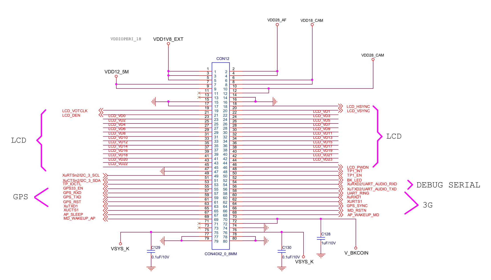

# CON3

## PIN1,3,5 - VDD1V8_EXT

接供电VDD1V8_EXT，在核心板上引自VDDIOPERI_18，该供电源引自核心板上PMIC芯片S5M8767A默认常开LDO脚VLDO12。

开发板上AD转换测试用滑动变阻器R24、板载按键（音量控制、返回、休眠、菜单）、GPIO座子J38（引出脚）、UART+KEYPAD座子J41（引出脚）、电平转换芯片74ALVC164245DGG（U9）A侧参考电平、TF卡槽J1引脚上拉电平、音频芯片WM8960GEFL（U10）数字供电脚（DCVDD/DBVDD）、XEINT18/KP_ROW2/ALV_DBG14引脚上拉电平、电平转换芯片TXS0102DCU（U17、U28、U29）A侧参考电平、RGB-LVDS转换芯片GM8285C（U12）的并行数据时钟采样边沿选择端CLKSEL上拉电平及芯片供电（IOVCC1、IOVCC2）、JTAG座子（引出脚/引脚上拉电平）、HDMI座子CON9热插拔信号端（HOTPLUG）上拉电平、启动模式（OM）选择拨码开关SW2上拉电平等均使用了这个电平。

## PIN2,4 - VDD28_AF

接供电VDD28_AF，该供电源引自核心板上PMIC芯片S5M8767A默认关闭LDO脚VLDO21。该引脚电源输出在uBoot结束后被Linux系统内的驱动程序开启。

150 mA，3.0 V供电脚。

开发板上开发板相机/AVIN连接器座子J27（引出脚）使用了这个电平。该电平同时通过2.2 uF电容C99接地。

## PIN6,8 - VDD18_CAM

接供电VDD18_CAM，该供电源引自核心板上PMIC芯片S5M8767A默认关闭LDO脚VLDO25。该引脚电源输出在uBoot结束后被Linux系统内的驱动程序开启。

300 mA，1.8 V供电脚。

开发板上开发板相机/AVIN连接器座子J27（引出脚）使用了这个电平。该电平同时通过2.2 uF电容C101接地。

## PIN7,9 - VDD12_5M

接供电VDD12_5M，该供电源引自核心板上PMIC芯片S5M8767A降压变换（Buck）回路FB6、SW6。

1.5 A，1.2 V供电脚。

开发板上无连接。

## PIN10,12 - VDD28_CAM

接供电VDD28_CAM，该供电源引自核心板上PMIC芯片S5M8767A默认关闭LDO脚VLDO20。该引脚电源输出在uBoot结束后被Linux系统内的驱动程序开启。

150 mA，3.0 V供电脚。

开发板上开发板相机/AVIN连接器座子J27（引出脚）使用了这个电平。该电平同时通过2.2 uF电容C100接地。

## PIN11,13 - NC

断开，无连接。

## PIN14,15,16,17 - GND

接地。

## PIN18 - LCD_HSYNC

开发板上接RGB-LCD座子CN1，并通过RGB-LVDS转换芯片GM8285C（U12）接LVDS接口J42。在核心板上接4412芯片的XvHSYNC/GPF0_0（AG17）引脚。

LCD水平同步（行同步）信号。

## PIN19 - LCD_VOTCLK

开发板上接RGB-LCD座子CN1，并通过RGB-LVDS转换芯片GM8285C（U12）接LVDS接口J42。在核心板上接4412芯片的XvVCLK/GPF0_3（AH16）引脚。

LCD视频时钟信号。

## PIN20 - LCD_VSYNC

开发板上接RGB-LCD座子CN1，并通过RGB-LVDS转换芯片GM8285C（U12）接LVDS接口J42。在核心板上接4412芯片的XvVSYNC/GPF0_1（AG18）引脚。

LCD垂直同步信号。

## PIN21 - LCD_DEN

开发板上接RGB-LCD座子CN1，并通过RGB-LVDS转换芯片GM8285C（U12）接LVDS接口J42。在核心板上接4412芯片的XvVDEN/GPF0_2（AF17）引脚。

LCD数据使能信号。

## PIN22~45 - LCD_VD[0..23]

开发板上接RGB-LCD座子CN1，并通过RGB-LVDS转换芯片GM8285C（U12）接LVDS接口J42。在核心板上接4412芯片的XvVD[0..23]引脚。

LCD显示内容RGB模式输出信号。

## PIN46 - LCD_PWDN

开发板上接RGB-LVDS转换芯片GM8285C（U12）的SHTDN（关断控制端）引脚。在核心板上接4412芯片的XGNSS_SCL/GPL1_0（AC4）引脚。

RGB-LVDS转换芯片关断控制信号，高电平时芯片正常输出，低电平时信号关断。

## PIN47 - GND

接地。

## PIN48 - TP1_INT

开发板上接电平转换芯片TXS0102DCU（U29）并接HDMI-LVDS接口CON17和LVDS接口J42。在核心板上接4412芯片的XEINT4/AUD_TRSTn/GNSS_TRSTn/ALV_DBG0/GPX0_4（E1）引脚。

## PIN49 - XuRTSn2/I2C_3_SCL

开发板上接电平转换芯片TXS0102DCU（U29）并接HDMI-LVDS接口CON17和LVDS接口J42。在核心板上接4412芯片的XuRTSn2/I2C_3_SCL/GPA1_3（AB18）引脚。

## PIN50 - TP1_EN

开发板上接电平转换芯片TXS0102DCU（U29）使能端OE。在核心板上接4412芯片的XGNSS_IMAG/GPL0_2（AC3）引脚。

## PIN51 - XuCTSn2/I2C_3_SDA

开发板上接电平转换芯片TXS0102DCU（U29）并接HDMI-LVDS接口CON17和LVDS接口J42。在核心板上接4412芯片的XuCTSn2/I2C_3_SDA/GPA1_2（AE27）引脚。

## PIN52 - BK_LED

开发板上接GPIO座子J38并引出。在核心板上接4412芯片的Xi2s2LRCK/PCM_2_FSYNC/SPI_2_nSS/GPC1_2（AG24）引脚。

## PIN53 - TP_IOCTL

经开发板电平转换芯片74ALVC164245DGG（U9）转换为BUF_TP_IOCTL信号后接HDMI-LVDS接口CON17和LVDS接口J42。在核心板上接4412芯片的XEINT3/AUD_TDO/GNSS_TDO/ALV_TDO/GPX0_3（D4）引脚。

## PIN54 - XuRXD2/UART_AUDIO_RXD

经开发板电平转换芯片74ALVC164245DGG（U9）转换为BUF_XuRXD2/UART_AUDIO_RXD信号后接串口TTL电平转换芯片MAX3232CSE和串口CON3（调试串口）。在核心板上接4412芯片的XuRXD2/UART_AUDIO_RXD/GPA1_0（AC20）引脚。

## PIN55 - GPS33_EN

开发板上未引出。在核心板上接4412芯片的Xmmc2CDn/GNSS_GPIO10/GPK2_2（M4）引脚。

## PIN56 - XuTXD2/UART_AUDIO_TXD

经开发板电平转换芯片74ALVC164245DGG（U9）转换为BUF_XuTXD2/UART_AUDIO_TXD信号后接串口TTL电平转换芯片MAX3232CSE和串口CON3（调试串口）。在核心板上接4412芯片的XuTXD2/UART_AUDIO_TXD/GPA1_1（AD25）引脚。

## PIN57 - GPS_RXD

经开发板电平转换芯片74ALVC164245DGG（U9）转换为BUF_GPS_RXD信号后接串口TTL电平转换芯片MAX3232CSE和串口CON2，并从开发板上UART+KEYPAD座子J41引出。在核心板上接4412芯片的XuTXD3UART_AUDIO_TXD/GPA1_5（AD26）引脚。

## PIN58 - UART_RING

接开发板上物理“主页”（PWRON1）键。在核心板上接到4412芯片的XEINT9/KP_COL1/ALV_DBG5/GPX1_1（B5）引脚。

## PIN59 - GPS_TXD

经开发板电平转换芯片74ALVC164245DGG（U9）转换为BUF_GPS_TXD信号后接串口TTL电平转换芯片MAX3232CSE和串口CON2，并从开发板上UART+KEYPAD座子J41引出。在核心板上接4412芯片的XuRXD3/UART_AUDIO_RXD/GPA1_4（AC24）引脚。

## PIN60 - XuRXD1

经开发板电平转换芯片74ALVC164245DGG（U9）转换为BUF_XuRXD1信号后从开发板上GPIO座子J38引出。在核心板上接4412芯片的XuRXD1/GPA0_4（AF22）引脚。

## PIN61 - GPS_RST

经开发板电平转换芯片74ALVC164245DGG（U9）转换为BUF_GPS_RST信号后从开发板上UART+KEYPAD座子J41引出。在核心板上接4412芯片的XspiCLK1/IEM_SCLK/GPB_4（AE23）引脚。

## PIN62 - XURTS1

开发板上接GPIO座子J41并引出。核心板上接4412芯片的XuRTSn1/I2C_2_SCL/GPA0_7（AG25）引脚。

## PIN63 - XuTXD1

开发板上接GPIO座子J38并引出。在核心板上接4412芯片的XuTXD1/GPA0_5（AC18）引脚。

## PIN64 - GPS_SYNC（核心板上标注为MD_PWON）

开发板上未引出。在核心板上接4412芯片的Xi2s1SCLK/PCM_1_SCLK/AC97BITCLK/GPC0_0（AE20）引脚。

## PIN65 - XUCTS1

开发板上未引出。在核心板上接4412芯片的XuCTSn1/I2C_2_SDA/GPA0_6（AD19）引脚。

## PIN66 - MD_RSTN

开发板上接MIPI连接器座子J9和4.3寸RGB-LCD座子CN1并引出。在核心板上接4412芯片的Xi2s1LRCK/PCM_1_FSYNC/AC97SYNC/GPC0_2（AH26）引脚。

## PIN67 - AP_SLEEP

开发板上接启动模式（OM）选择拨码开关SW2。在核心板上接4412芯片的Xi2s1SDI/PCM_1_SIN/AC97SDI/GPC0_3（AJ26）引脚。

## PIN68 - AP_WAKEUP_MD

开发板上未引出。在核心板上接4412芯片的Xi2s1SDO/PCM_1_SOUT/AC97SDO/GPC0_4（AH23）引脚。

## PIN69 - MD_WAKEUP_AP

接开发板Wi-Fi连接器座子J40并引出。在核心板上接4412芯片的XEINT21/KP_ROW5/ALV_DBG17/GPX2_5（E6）引脚。

## PIN70,72 - V_BKCOIN

接供电V_BKCOIN。在开发板上接电池模块和直流电平DC33V。在核心板上接PMIC芯片S5M8767A的备用电池充电模拟输出脚BKCOIN。

## PIN71,73 - NC

断开，无连接。

## PIN74 - GND

接地。

## PIN75,76 - VSYS_K

接电源VSYS_K，并在开发板上通过0.1 uF电容C129和C130对地滤波。

## PIN77,78,79,80 - GND

接地。
