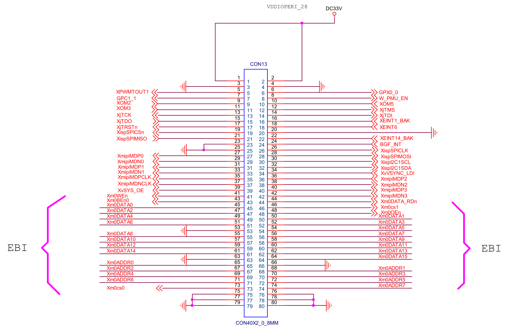

# CON4

## PIN1,2 - DC33V

接供电DC33V，在核心板上标为VDDIOPERI_28。该供电源引自核心板上PMIC芯片S5M8767A默认关闭LDO脚VLDO18。该引脚电源输出在uBoot结束后被Linux系统内的驱动程序开启。

300 mA，2.8V供电脚。

开发板上GPIO座子J38（引出脚）、电池模块（接V_BKCOIN）、TTL电平转换芯片MAX3232CSE（U4）、板载USB以太网卡DM9621ANP（U8）、电平转换芯片74ALVC164245DGG（U9）、音频芯片WM8960GEFL（U10）、LVDS发送器GM8285C（U12）、电平转换芯片TXS0102DCU（U29）等作为数字电源（VCC）使用或引出了该供电。

## PIN3,4 - GND

接地。

## PIN5 - XPWMTOUT1

经开发板电平转换芯片74ALVC164245DGG（U9）转换为BUF_XPWMTOUT1信号后接HDMI-LVDS接口CON17、LVDS接口J42、4.3寸RGB-LCD座子CN1、MIPI接口J9。在核心板上接4412芯片的XpwmTOUT1/LCD_PWM/GPD0_1（AD24）引脚。

显示器PWM信号输出引脚。

## PIN6 - GPX0_0

开发板上接4.3寸RGB-LCD座子CN1。在核心板上接4412芯片的XEINT0/AUD_TCK/GNSS_TCK/ALV_TCK/GPX0_0（F4）引脚。

## PIN7 - GPC1_1

接开发板上Wi-Fi连接器座子J40并引出（和被NC电阻R28断开的WIFI_PWDN共用引脚），并经开发板电平转换芯片74ALVC164245DGG（U9）转换为BUF_GPC1_1信号后接GPIO座子J38。在核心板上接4412芯片的Xi2s2CDCLK/PCM_2_EXTCLK/SPDIF_EXTCLK/SPI_2_CLK/GPC1_1（AH25）引脚。

## PIN8 - W_PMU_EN（核心板上标注为GPC1_0）

接开发板上Wi-Fi连接器座子J40并引出。在核心板上接4412芯片的Xi2s2SCLK/PCM_2_SCLK/SPDIF_0_OUT/GPC1_0（AH24）引脚。

## PIN9 - XOM2

开发板上接启动模式（OM）选择拨码开关SW2。在核心板上接4412芯片的XOM2（G1）引脚。

## PIN10 - XOM5

开发板上接启动模式（OM）选择拨码开关SW2。在核心板上接4412芯片的XOM5（G2）引脚。

## PIN11 - XOM3

开发板上接启动模式（OM）选择拨码开关SW2。在核心板上接4412芯片的XOM3（G3）引脚。

## PIN12 - XjTMS

接开发板JTAG座子CON16并引出。在核心板上接4412芯片的XjTMS/ETC0_1（AE2）引脚。

JTAG测试模式选择（TMS）引脚。

## PIN13 - XjTCK

接开发板JTAG座子CON16并引出。在核心板上接4412芯片的XjTCK/ETC0_2（AE3）引脚。

JTAG测试时钟输入（TCK）引脚。

## PIN14 - XjTDI

接开发板JTAG座子CON16并引出。在核心板上接4412芯片的XjTDI/ETC0_3（AD1）引脚。

JTAG测试数据输入（TDI）引脚。

## PIN15 - XjTDO

接开发板JTAG座子CON16并引出。在核心板上接4412芯片的XjTDO/ETC0_4（AD2）引脚。

JTAG测试数据输出（TDO）引脚。

## PIN16 - XEINT1_BAK

接开发板上GPIO座子J38并引出。在核心板上接4412芯片的XEINT1/AUD_TMS/GNSS_TMS/ALV_TMS/GPX0_1（E5）引脚。

## PIN17 - XjTRSTn

接开发板JTAG座子CON16并引出。在核心板上接4412芯片的XjTRSTn/ETC0_0（AD5）引脚。

JTAG测试复位（TRST）引脚。

## PIN18 - XEINT6

开发板上接启动模式（OM）选择拨码开关SW2。在核心板上接4412芯片的XEINT6/ALV_DBG2/GPX0_6（D3）引脚。

## PIN19 - XispSPICSn

开发板上未引出。在核心板上接4412芯片的XispSPICSn/CAM_GPIO15/GPM4_5（AG2）引脚。

## PIN20 - GND

接地。

## PIN21 - XispSPIMISO

接开发板上GPIO座子J38并引出。在核心板上接4412芯片的XispSPIMISO/CAM_GPIO16/GPM4_6（AH3）引脚。

## PIN22 - XEINT14_BAK

接开发板上UART+KEYPAD座子J41并引出。在核心板上接4412芯片的XEINT14/KP_COL6/ALV_DBG10/GPX1_6（D1）引脚。

## PIN23 - GND

接地。

## PIN24 - BGF_INT（核心板上标注为XEINT20_BAK）

接开发板上Wi-Fi连接器座子J40并引出。在核心板上接4412芯片的XEINT20/KP_ROW4/ALV_DBG16/GPX2_4（C4）引脚。

## PIN25 - GND

接地。

## PIN26 - XispSPICLK

接开发板上GPIO座子J38并引出。在核心板上接4412芯片的XispSPICLK/CAM_GPIO14/GPM4_4（AH1）引脚。

## PIN27 - XmipiMDP0

开发板上接MIPI连接器座子J9并引出。在核心板上接4412芯片的XmipiMDP0（AJ17）引脚。

## PIN28 - XispSPIMOSI

接开发板上GPIO座子J38并引出。在核心板上接4412芯片的XispSPIMOSI/CAM_GPIO17/GPM4_7（AF1）引脚。

## PIN29 - XmipiMDN0

开发板上接MIPI连接器座子J9并引出。在核心板上接4412芯片的XmipiMDN0（AK17）引脚。

## PIN30 - XispI2C1SCL

开发板上未引出。在核心板上接4412芯片的XispI2C1SCL/CAM_GPIO12/CAM_SPI1_CLK/GPM4_2（AE6）引脚，同时通过1K电阻R50接到VDDIOAP_18。

## PIN31 - XmipiMDP1

开发板上接MIPI连接器座子J9并引出。在核心板上接4412芯片的XmipiMDP1（AJ16）引脚。

## PIN32 - XispI2C1SDA

开发板上未引出。在核心板上接4412芯片的XispI2C1SDA/CAM_GPIO13/CAM_SPI1_nSS/GPM4_3（AF7）引脚，同时通过1K电阻R53接到VDDIOAP_18。

## PIN33 - XmipiMDN1

开发板上接MIPI连接器座子J9并引出。在核心板上接4412芯片的XmipiMDN1（AK16）引脚。

## PIN34 - XvVSYNC_LDI

开发板上未引出。在核心板上接4412芯片的XvVSYNC_LDI/GPF3_4（AC16）引脚。

## PIN35 - XmipiMDPCLK

开发板上接MIPI连接器座子J9并引出。在核心板上接4412芯片的XmipiMDPCLK（AJ15）引脚。

## PIN36 - XmipiMDP2

开发板上接MIPI连接器座子J9并引出。在核心板上接4412芯片的XmipiMDP2（AJ14）引脚。

## PIN37 - XmipiMDNCLK

开发板上接MIPI连接器座子J9并引出。在核心板上接4412芯片的XmipiMDNCLK（AK15）引脚。

## PIN38 - XmipiMDN2

开发板上接MIPI连接器座子J9并引出。在核心板上接4412芯片的XmipiMDN2（AK14）引脚。

## PIN39 - XvSYS_OE

开发板上未引出。在核心板上接4412芯片的XvSYS_OE/GPF3_5（AC14）引脚。

## PIN40 - XmipiMDP3

开发板上接MIPI连接器座子J9并引出。在核心板上接4412芯片的XmipiMDP3（AJ13）引脚。

## PIN41 - Xm0WEn

开发板上未引出，在核心板上接4412芯片的Xm0WEn/MP00_5（Y6）引脚（和GPIO引脚组GPY存在复用）。

外部总线接口（EBI）写选通引脚。

## PIN42 - XmipiMDN3

开发板上接MIPI连接器座子J9并引出。在核心板上接4412芯片的XmipiMDN3（AK13）引脚。

## PIN43 - Xm0BEn0

开发板上未引出，在核心板上接4412芯片的Xm0BEn0/MP01_0（H4）引脚（和GPIO引脚组GPY存在复用）。

外部总线接口（EBI）字节写选通/字节选通引脚。

## PIN44 - Xm0DATA_RDn

开发板上未引出，在核心板上接4412芯片的Xm0DATA_RDn/MP01_3（R3）引脚（和GPIO引脚组GPY存在复用）。

外部总线接口（EBI）数据就绪信号引脚。

## PIN46 - Xm0cs1

开发板上未引出，在核心板上接4412芯片的Xm0CSn1/NF_CSn3/MP00_1（R4）引脚（和GPIO引脚组GPY存在复用）。

外部总线接口（EBI）片选信号1引脚。

## PIN48 - Xm0OEn

开发板上未引出，在核心板上接4412芯片的Xm0OEn/MP00_4（W7）引脚（和GPIO引脚组GPY存在复用）。

外部总线接口（EBI）读选通引脚。

## PIN73 - Xm0cs0

开发板上未引出，在核心板上接4412芯片的Xm0CSn0/NF_CSn2/MP00_0（Y5）引脚（和GPIO引脚组GPY存在复用）。

外部总线接口（EBI）片选信号0引脚。

## PIN45,47,49,50,51,52,54-62,64 - Xm0DATA[0..15]

开发板上未引出，在核心板上接4412芯片的Xm0DATA[0..15]引脚（和GPIO引脚组GPY存在复用）。

外部总线接口（EBI）16位宽度数据（DATA）引脚。

## PIN65,67-72,74 - Xm0ADDR[0..7]

开发板上未引出，在核心板上接4412芯片的Xm0ADDR[0..7]引脚（和GPIO引脚组GPY存在复用）。

外部总线接口（EBI）8位宽度地址（ADDR）引脚。

## PIN53,63,66,75-80 - GND

接地。
